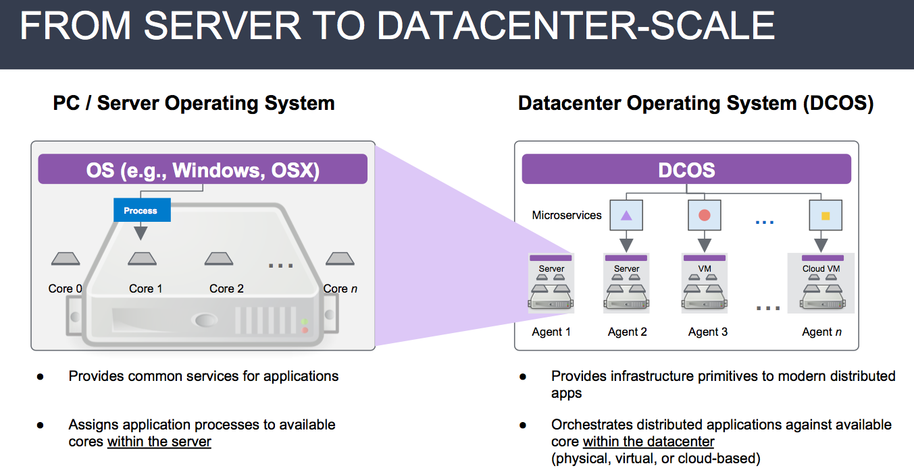
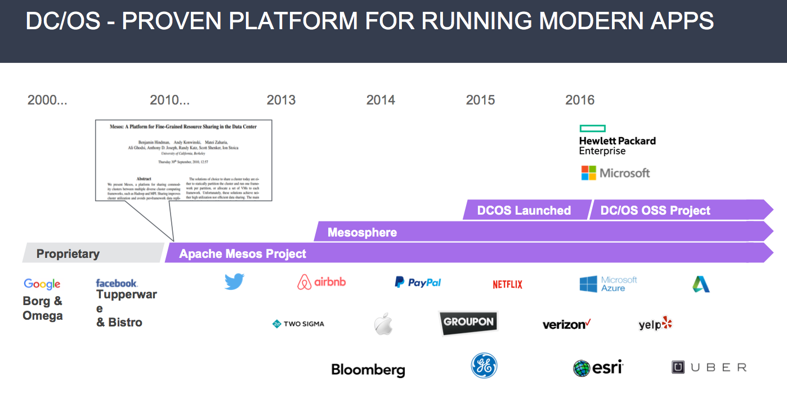
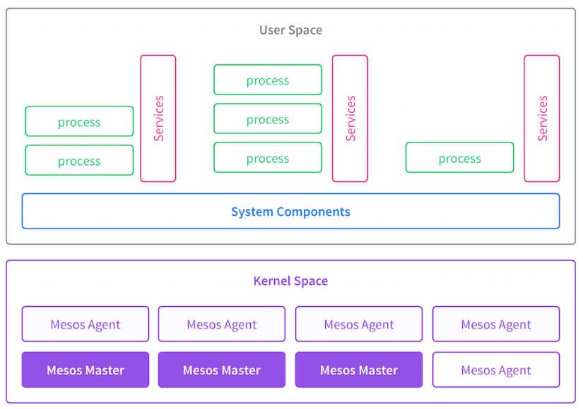
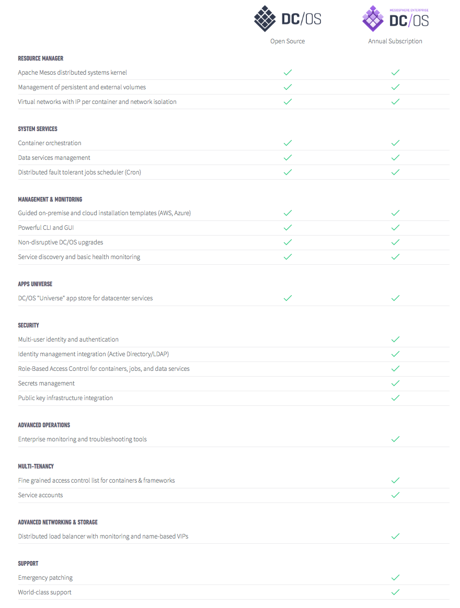
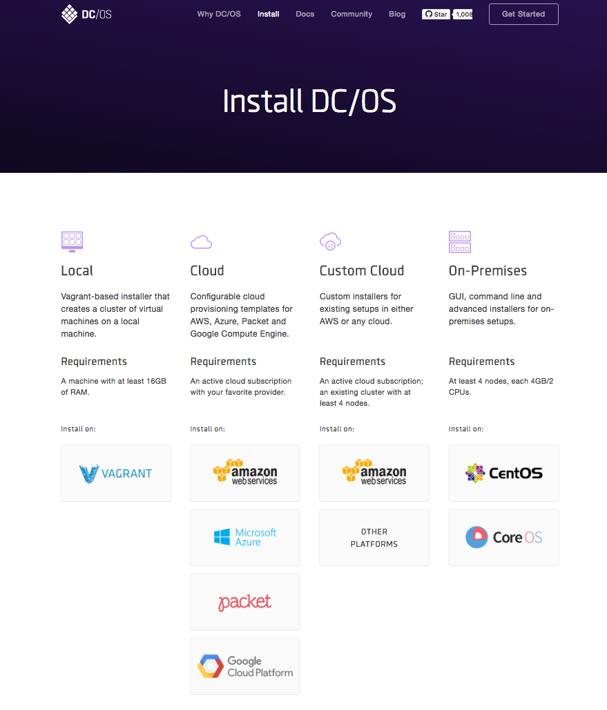
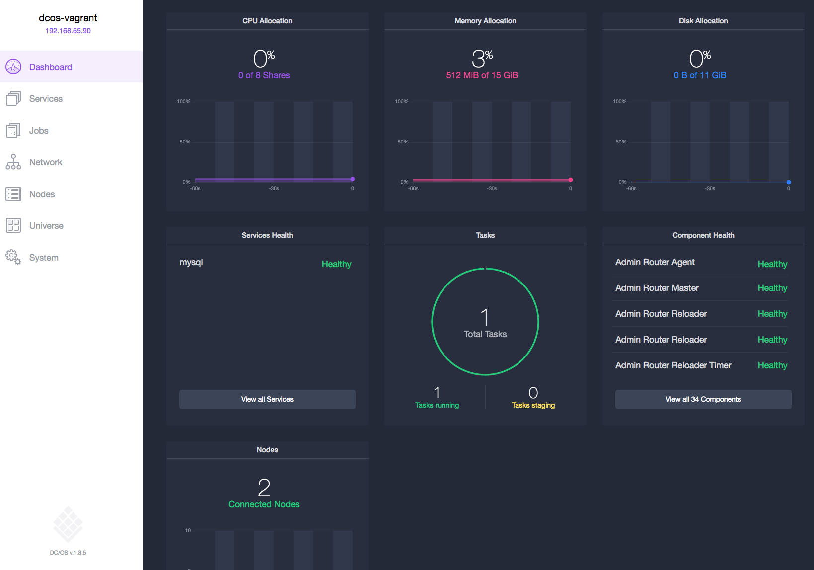

# Learning Mesosphere DC/OS

This post is to help people getting started with DC/OS.

You can learn Mesosphere and DC/OS by attending trainings or self-learning. The following contents are some pointers I used while doing self-learning.


##Official Mesosphere training
Mesosphere company offers trainings for DC/OS Administration.

* 2-day onsite 
* 3-day virtual

Pricing is $2000 for either option. For locations and time, please see <https://mesosphere.com/training/>

##Self-Learning
###Fundamentals

If you are new to Mesosphere and DC/OS, a good video to see how DC/OS looks like is this 5-min DC/OS demo.

[](https://www.youtube.com/watch?v=VdhJ_Fm3_mk)

So What is DC/OS? This is the definition from Mesosphere.

> DC/OS is a distributed operating system based on the Apache Mesos distributed systems kernel. It enables the management of multiple machines as if they were a single computer.

A good graphic will help you understand more why we need something like this in current large scale, distributed compute era.



Back in personal computer time, it's the PC operating system running and coordinating different tasks so developers can focus on their app writing instead of low-level jobs like resource scheduling.

In the current cloud and container distributed computing world, a modern application management and orchestration engine is much needed if we want to scale things up. This is the challenge Mesosphere and DC/OS will try to solve.

Many times when you watch Mesosphere presentations, it's emphasized that DC/OS is based on [Apache Mesos](https://en.wikipedia.org/wiki/Apache_Mesos), which is an open-source cluster manager originally developed at the University of California, Berkeley. 

One of the original Mesos project members [Benjamin Hindman](https://www.linkedin.com/in/benjamin-hindman-880b219) co-founded Mesosphere in 2013.



Mesosphere DC/OS has multiple components beyond core Mesos. This is a good starter for [DC/OS architecture](https://docs.mesosphere.com/1.8/overview/architecture/).



Mesosphere currently offers two flavors of DC/OS.

* Enterprise version
* Open-Sourced version

In April, 2016, [Mesosphere open-sourced core DC/OS code](https://mesosphere.com/blog/2016/04/19/open-source-dcos/) so users can test and deploy DC/OS by themselves.

So what's the difference between Mesosphere Enterprise vs open-sourced versions of DC/OS? Enterprise DC/OS offers more features like advanced security, networking and multi-tenancy. It is based on the the number of physical/virtual nodes and uses annual subscription model. The following picture highlights some quick comparison facts. For more details, please check [Mesosphere Enterprise DC/OS pricing model](https://mesosphere.com/pricing/).




###Installation
DC/OS can be installed in cloud provider, On-Premises data center for production. For self-learning, users will likely to use [local Vagrant-based installation](#using-vagrant).



**Operating System Requirements**

DC/OS requires either physical or virtual CentOS or CoreOS Linux nodes for master and agent nodes installation. 

---

**Note:** Ubuntu is not recommended for user self-deployment(it's likely to be supported after Mesosphere finished all tests for Ubuntu). Microsoft Azure Container Services actually uses DC/OS on Ubuntu 16.04

---

### <a name="using-vagrant"></a>Self-Learning DC/OS Using Vagrant
All docs are at [DCOS-Vagrant Github repository](https://github.com/dcos/dcos-vagrant). 

A couple of things to note, do **NOT** go with latest Vagrant and VirtualBox version(as of current October, 2016). Vagrant 1.8.4 works well but current latest 1.8.6(and 1.8.5) have [issues](https://github.com/dcos/dcos-vagrant/blob/master/docs/deploy.md#setup). And if you settle for Vagrant 1.8.4, it won't support VirtualBOX 5.1 release so you should use the following versions.

The following is the combination works well.

Components  | Version
------------- | -------------
Vagrant  | 1.8.4
VirtualBox  | 5.0.26

The output from my MAC

```bash
$ vagrant --version
Vagrant 1.8.4
$ vboxmanage --version
5.0.26r108824
```

With the above set, you also need to download the DC/OS installer file(about 750M) and then following github instructions for installation.

```bash
$ curl -O https://downloads.dcos.io/dcos/stable/dcos_generate_config.sh
```

The DC/OS dashboard should be accessible from master node HTTP port after installation.




## Help

You'll get stuck at one point and here are [DC/OS docs](https://dcos.io/docs/1.8/) for the research. 

After doing your homework and you still can not figure out why, it's time to ask questions.
Mesosphere [Slack Channel](http://chat.mesosphere.com/) and [Google Groups](https://groups.google.com/a/dcos.io/forum/#!forum/users) are good resources and people are very helpful to get you some directions and answers.


